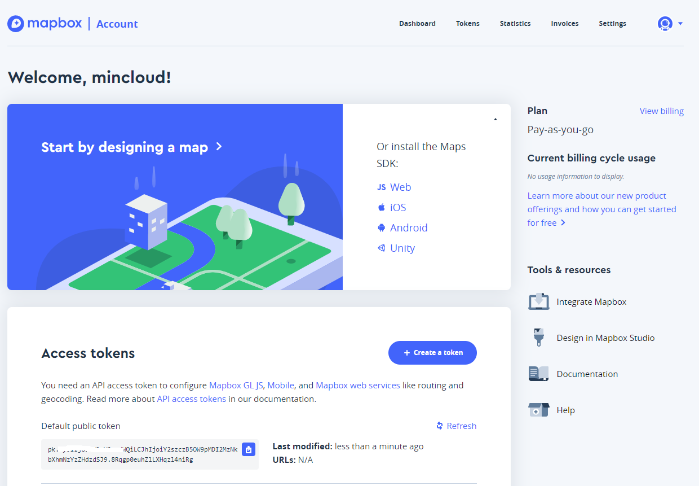
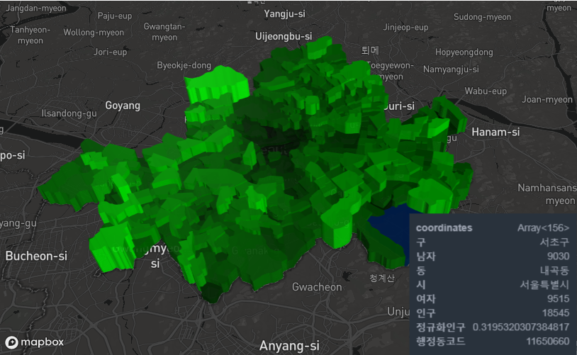
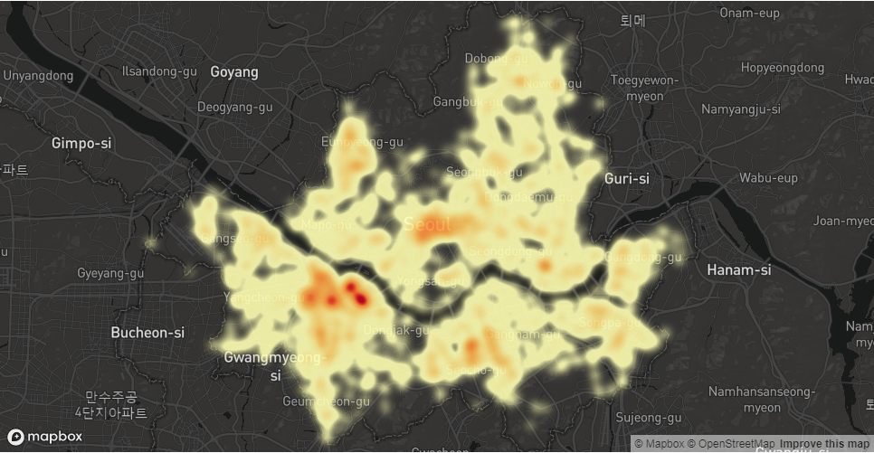

# The Python Study Project
[](https://gitter.im/Python_Project/community)&nbsp;
&nbsp;

### All Codes implemented in Python (with Jupyter Notebook)

These implementations are for learning purposes. They may be less efficient than the implementations in the Python standard library.
Use Jupyter Notebook & PyCharm Community Edition.

#### ■ Python Data Analytic Library

- [](https://numpy.org) : 벡터 및 행렬 계산에 편의를 제공하는 라이브러리로 pandas,matplotlib의 기본 base library
- [](https://pandas.pydata.org/) : 고유하게 정의된 자료 구조를 활용해서 빅데이터 분석 가능
- [](http://matplotlib.org) : numpy와 pasndas를 통해 얻은 데이터 분석결과를 시각화 해주는 라이브러리
- [](https://seaborn.pydata.org/index.html) : matplotlib을 기반으로 하는 Python데이터 시각화 라이브러리로 매력적이고 정보를 제공하는 통계 그래픽을 그리기 위한 높은 수준의 인터페이스를 제공

## Time Series Analytics with Pandas (On Windows)

### ■ Prerequisites for running with `Anaconda3` install

- `python` version 3
- `pandas` version or later
- `numpy` version 1.15.4 or later
- `matplotlib` version 3.0.2 or later
- `seaborn` version 0.9.0 or later
- `pandas` version 0.23.4 or later
- `scikit-learn` 0.20.2 or later
- `jupyter` version 1.0.0 or later
- `statsmodels` version 0.9.0 or later

- `konlpy` version 0.5.1 or later
- `JPype1` version 0.7.0 or later
- `pytagcloud` version 0.3.5 or later
- `simplejson` version 3.16.0 or later

```
conda create --name mincloud python=3
conda install pandas jupyter seaborn scikit-learn statsmodels
conda info --envs
```
```bash
Collecting package metadata: done
Solving environment: done

## Package Plan ##

  environment location: C:\Users\mincloud\Anaconda3

  added / updated specs:
    - jupyter
    - pandas
    - scikit-learn
    - seaborn
    - statsmodels

The following packages will be downloaded:

    		package                |   		 build
    ---------------------------|--------------------------------
    ca-certificates-2018.03.07 |                0         155 KB
    certifi-2018.4.16          |           py36_0         143 KB
    conda-4.6.14               |           py36_0         2.1 MB
    openssl-1.0.2o             |       h8ea7d77_0         5.4 MB
    ------------------------------------------------------------
                                           Total:         7.8 MB

The following packages will be SUPERSEDED by a higher-priority channel:

  ca-certificates                                anaconda --> pkgs/main
  certifi                                        anaconda --> pkgs/main
  conda                                          anaconda --> pkgs/main
  openssl                                        anaconda --> pkgs/main
```

### ■ Setup & Run

```
> git clone https://github.com/mincloud1501/Python.git
```
- Install the environment for this hands-on by running:
```
> cd Python/
> conda activate mincloud
> python -m ipykernel install --name mincloud --user
> jupyter notebook --port=8888
```

## USEFUL SHORTCUTS (Jupyter Notebook)
```js
run_and_pass = 'Shift + Enter'
run_and_add_cell = 'Alt + Enter'
run_and_stay = 'Ctrl + Enter'

recommendations = 'Tab'
docstrings = 'Shift + Tab'

add_hashtag = 'Ctrl + /'
add_cell = 'b'
delete_cell = 'dd'
```

### ■ Prerequisites for collecting `Facebook` data [](https://developers.facebook.com/docs/graph-api)

- 페이스북 (http://www.facebook.com) 가입
- 페이스북 개발자 페이지(http://developer.facebook.com) 계정 생성
- Facebook API 사용등록 및 신규 app 생성
- 대시보드에서 `App ID`와 `Secret Code` 확인

### ■ Prerequisites for collecting `Naver` data [](https://developers.naver.com/docs/search/news/)

- 네이버 개발자 페이지(https://developers.naver.com) 에서 오픈API 이용 신청에서 검색 API 추가
- 웹 서비스 URL (http://localhost) 등록
- `Client ID`와 `Client Secret` 확인

### ■ `D3.js` Reference for Data Visualizations

- [](https://d3js.org/)
- [](https://bl.ocks.org/mbostock)
- [](https://bost.ocks.org/mike/)

---

### ■ `deck.gl` 

- deck.gl offers an extensive catalog of pre-packaged visualization "layers", including ScatterplotLayer, ArcLayer, TextLayer, GeoJsonLayer, etc.
- Uber 에서 만든 자바스크립트 공간 데이터 시각화 라이브러리며, pydeck 은 이 라이브러리를 파이썬에서도 쓸 수 있도록 만든 패키지
- 대용량 데이터도 거뜬하게 렌더링할 수 있으며, 렌더링이 좀 버거울 수도 있는 일부 레이어는 GPU 연산을 제공한다.

#### Installation

```bash
$npm install deck.gl
```

- 다른 채널에서 다른 geo package를 설치하면 종속성 충돌이 발생할 수 있으므로, 새로운 환경에서 geopandas 설치 권고

```bash
$conda create -n geo_env
$conda activate geo_env
$conda config --env --add channels conda-forge
$conda config --env --set channel_priority strict
$conda install python=3 geopandas
```

---

### ■ `Pydeck` 

- Pydeck library is a set of Python bindings for making spatial visualizations with deck.gl, optimized for a Jupyter Notebook environment.

#### Installation

```bash
$pip install pydeck
```
- Jupyter notebook server에 설치하면, widget extension을 사용할 수 있다.

```bash
$jupyter nbextension install --sys-prefix --symlink --overwrite --py pydeck
$jupyter nbextension enable --sys-prefix --py pydeck
```

##### `pdk.Layer`

- 레이어를 지도 위에 올릴 때, 항상 이 클래스를 통해서 만든다.

```js
pdk.Layer
  type = "미리 정의된 레이어 타입",
  id = "이 레이어의 아이디 (optional)",
  data = "pandas.DataFrame 또는 geojson url",
)
```

##### `pdk.ViewState`

- folium이나 mapboxgl에서도 흔히 볼 수 있는 파라미터들로 렌더링 시, 초기화 뷰에 대한 설정이다.

```js
pdk.ViewState(
  longitude = "중심 경도 (default 0)",
  latitude = "중심 위도 (default 0)",
  zoom = "줌 레벨 (default 0)",
  pitch = (default 0),
  bearing = (default 0),
  **kwargs,
)
```

##### `pdk.Deck`

- 생성된 Layer, View Info, Map Style 등 모든 요소를 모아 출력시킬 수 있는 클래스
- mapboxgl 과 비교되는 가장 큰 장점으로 Layer를 쌓을 땐, layers 리스트에 추가하면 된다.

```js
pdk.Deck(
  layers=[],
  views=[{"controller": true, "type": "MapView"}],
  map_style='mapbox://styles/mapbox/dark-v9',
  mapbox_key=None,
  initial_view_state={"bearing": 0, "latitude": 0.0, "longitude": 0.0, "maxZoom": 20, "minZoom": 0, "pitch": 0, "zoom": 1},
  width='100%',
  height=500,
  tooltip=True,
)
```

---

#### Mapbox API token

- [](http://mapbox.com/) 에 계정 생성
- Access Token Copy
- Mapbox basemaps 사용을 위한 환경변수 설정 `MAPBOX_API_KEY=<mapbox-key-here>`




#### Getting started (Demo.ipynb)

```js
import pydeck as pdk

# 2014 locations of car accidents in the UK
UK_ACCIDENTS_DATA = ('https://raw.githubusercontent.com/uber-common/'
                     'deck.gl-data/master/examples/3d-heatmap/heatmap-data.csv')

# Define a layer to display on a map
layer = pdk.Layer(
    'HexagonLayer',
    UK_ACCIDENTS_DATA,
    get_position='[lng, lat]',
    auto_highlight=True,
    elevation_scale=50,
    pickable=True,
    elevation_range=[0, 3000],
    extruded=True,                 
    coverage=1)

# Set the viewport location
view_state = pdk.ViewState(
    longitude=-1.415,
    latitude=52.2323,
    zoom=6,
    min_zoom=5,
    max_zoom=15,
    pitch=40.5,
    bearing=-27.36)

# Render
r = pdk.Deck(layers=[layer], initial_view_state=view_state)
r.to_html('demo.html')

# Jupyter 환경 밖에서 실행 시
r.to_html('demo.html', notebook_display=False)
```

- pydeck은 `shapely.geometry.multipolygon` 형태를 읽지 못하므로 항상 geometry에 연속된 포인트들을 갖는 리스트 값이 있어야 한다.

```js
def multipolygon_to_coordinates(x):
  lon, lat = x[0].exterior.xy
  return [[x, y] for x, y in zip(lon, lat)]

df['coordinates'] = df['geometry'].apply(multipolygon_to_coordinates)
del df['geometry']
```

- pydeck 을 이용하여 각 데이터를 Choropleth로 시각화 할 수 있다. pydeck에서는 Choropleth로 부르지 않고 PolygonLayer라고 한다. (sample_older_seoul.ipynb)



```js
// Make layer
layer = pdk.Layer(
    'PolygonLayer', // 사용할 Layer 타입
    df,             // 시각화에 쓰일 데이터프레임
    get_polygon='coordinates', // geometry 정보를 담고있는 컬럼 이름
    get_fill_color='[0, 255*정규화인구, 0]', // 각 데이터 별 rgb 또는 rgba 값 (0~255)
    pickable=True, // 지도와 interactive 한 동작 on
    auto_highlight=True // 마우스 오버(hover) 시 박스 출력
)

// Set the viewport location
center = [126.986, 37.565]
view_state = pdk.ViewState(
    longitude=center[0],
    latitude=center[1],
    zoom=10
)

// Render
r = pdk.Deck(layers=[layer], initial_view_state=view_state)
r.show()
```

- HeatmapLayer를 이용하여 Point들의 밀집도를 한 눈에 파악 가능하다. (sample_toilet_seoul.ipynb)



```js
layer = pdk.Layer(
    'HeatmapLayer',
    df,
    get_position='[lng, lat]'
)

center = [126.986, 37.565]
view_state = pdk.ViewState(
    longitude=center[0],
    latitude=center[1],
    zoom=10
)

r = pdk.Deck(layers=[layer], initial_view_state=view_state)
r.show()
```


## Category

See the [Category](DIRECTORY.md).